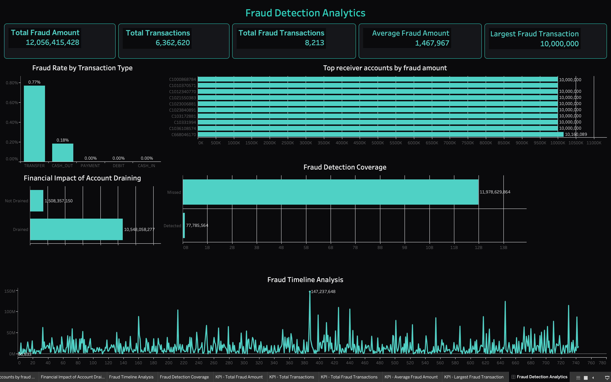
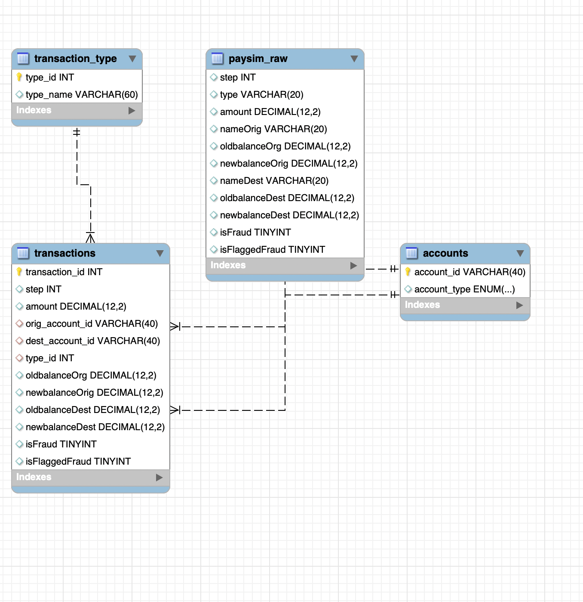

# 🔍 Fraud Detection Analytics — PaySim Dataset

> **"Who's the thief?"** — A complete end-to-end SQL + Tableau fraud detection project built from raw data to normalized database to interactive dashboard.

---

## 📌 Project Overview

This project performs full exploratory data analysis (EDA), database normalization, and fraud detection on the **PaySim synthetic mobile money dataset** — 6,362,620 transactions simulating real-world mobile money fraud patterns.

**Tools Used:** MySQL · MySQL Workbench · Terminal (CLI) · Tableau Public
**Dataset:** [PaySim — Kaggle](https://www.kaggle.com/datasets/ealaxi/paysim1)

**Dashboard:** [Fraud Detection Analytics — Tableau Public](https://public.tableau.com/app/profile/muhammad.ammar.saleem/viz/FraudDetectionAnalytics/FraudDetectionAnalytics)

---

## 🎯 Objective

Detect fraud patterns in mobile money transactions by:
- Loading and profiling 6.3M rows of raw data
- Designing a normalized relational schema based on EDA findings
- Writing fraud detection queries to uncover real patterns
- Visualizing findings in an interactive Tableau dashboard

---

## 📁 Repository Structure

```
Fraud_Detection/
│
├── fraud_detection.sql       # Complete documented SQL file
│                              # (EDA + Schema + Queries)
│
├── data/
│   ├── transactions.csv       # 6,362,620 rows — main fact table
│   ├── accounts.csv           # 9,073,900 unique accounts
│   └── transaction_type.csv   # 5 transaction types lookup
│
└── README.md
```

---

## 🚀 How I Built This

### Step 1 — Finding & Loading the Data
Found the PaySim dataset on Kaggle — 493MB, 6.3M rows of synthetic mobile money transactions. Downloaded and attempted to load via MySQL Workbench's GUI import wizard — it froze at ~7,000 rows.

**The fix:** Used Terminal CLI with `LOAD DATA LOCAL INFILE` which loaded all 6.3M rows in 43 seconds.

```bash
/usr/local/mysql/bin/mysql --local-infile=1 -u root -p
```

```sql
LOAD DATA LOCAL INFILE '/path/to/PS_log.csv'
INTO TABLE paysim_raw
FIELDS TERMINATED BY ','
ENCLOSED BY '"'
LINES TERMINATED BY '\n'
IGNORE 1 ROWS;
```

> **What I learned:** GUI tools fail on large datasets. `LOAD DATA LOCAL INFILE` is the right tool for bulk loading — it streams data instead of inserting row by row.

---

### Step 2 — Raw Staging Table
Before any analysis or design decisions, loaded everything into one flat staging table `paysim_raw` matching the CSV structure exactly. No normalization yet — you can't design a good schema until you understand the data.

---

### Step 3 — Exploratory Data Analysis (EDA)
Ran 4 targeted queries to answer 4 specific design questions before touching schema design:

**Q1: Are accounts unique or do they repeat?**
```sql
SELECT COUNT(DISTINCT nameOrig) FROM paysim_raw; -- 6,353,307
SELECT COUNT(DISTINCT nameDest) FROM paysim_raw; -- 2,722,362
```
→ Senders almost never repeat. Receivers repeat heavily — some up to 113 times.

**Q2: Customer vs Merchant split?**
```sql
SELECT
  COUNT(CASE WHEN nameOrig LIKE 'C%' THEN 1 END) AS orig_customer,
  COUNT(CASE WHEN nameOrig LIKE 'M%' THEN 1 END) AS orig_merchant
FROM paysim_raw;
```
→ 100% of senders are customers. Receivers are a mix of customers (66%) and merchants (34%). Merchants never initiate transactions.

**Q3: Which accounts appear most frequently?**
```sql
SELECT COUNT(nameDest) FROM paysim_raw
GROUP BY nameDest
ORDER BY COUNT(nameDest) DESC
LIMIT 20;
```
→ Top receiver accounts appear 88–113 times. High-frequency receivers = primary fraud suspects.

**Q4: Which transaction type has the highest fraud rate?**
```sql
SELECT type, SUM(isFraud) AS total_fraud, AVG(isFraud)*100 AS percent_fraud
FROM paysim_raw
GROUP BY type
ORDER BY percent_fraud DESC;
```
→ **TRANSFER (0.77%) and CASH_OUT (0.18%) are the ONLY types with fraud.** PAYMENT, DEBIT, CASH_IN — zero fraud cases.

---

### Step 4 — Schema Design
Based on EDA findings, normalized into 3 tables:

```
transaction_type (lookup)
        │
        └──► transactions (central fact table) ◄──── accounts
```

**Why 3 tables:**
- Receivers repeat heavily → `accounts` table needed
- Only 5 fixed transaction types → `transaction_type` lookup table
- Fraud only in TRANSFER/CASH_OUT → `isFraud` is a critical column in `transactions`

**accounts**
| Column | Type |
|--------|------|
| account_id | VARCHAR(40) PK |
| account_type | ENUM('customer','merchant') |

**transaction_type**
| Column | Type |
|--------|------|
| type_id | INT AUTO_INCREMENT PK |
| type_name | VARCHAR(60) |

**transactions**
| Column | Type |
|--------|------|
| transaction_id | INT AUTO_INCREMENT PK |
| step | INT |
| amount | DECIMAL(12,2) |
| orig_account_id | VARCHAR(40) FK → accounts |
| dest_account_id | VARCHAR(40) FK → accounts |
| type_id | INT FK → transaction_type |
| oldbalanceOrg | DECIMAL(12,2) |
| newbalanceOrig | DECIMAL(12,2) |
| oldbalanceDest | DECIMAL(12,2) |
| newbalanceDest | DECIMAL(12,2) |
| isFraud | TINYINT |
| isFlaggedFraud | TINYINT |

---

### Step 5 — Data Population
Populated normalized tables from staging table in correct order (respecting foreign key dependencies):

```sql
-- 1. Lookup table first
INSERT INTO transaction_type (type_name)
SELECT DISTINCT type FROM paysim_raw;

-- 2. Accounts (CASE converts C/M prefix to readable enum)
INSERT IGNORE INTO accounts (account_id, account_type)
SELECT DISTINCT nameOrig,
    CASE WHEN LEFT(nameOrig,1) = 'C' THEN 'customer' ELSE 'merchant' END
FROM paysim_raw
UNION
SELECT DISTINCT nameDest,
    CASE WHEN LEFT(nameDest,1) = 'C' THEN 'customer' ELSE 'merchant' END
FROM paysim_raw;

-- 3. Transactions last (JOIN to get type_id)
INSERT INTO transactions (...)
SELECT p.*, tt.type_id
FROM paysim_raw p
JOIN transaction_type tt ON p.type = tt.type_name;
```

> **Challenge:** Connection kept dropping on large operations. Solution: `SET SESSION wait_timeout = 600` and running all heavy operations from Terminal, not Workbench.

---

## 🔎 Fraud Detection Findings

### Finding 1 — Top Receiver Accounts

```sql
SELECT a2.account_id, COUNT(t.isFraud), SUM(t.amount) AS total_amount
FROM transactions t
JOIN accounts a2 ON t.dest_account_id = a2.account_id
WHERE isFraud = 1
GROUP BY a2.account_id, a2.account_type
ORDER BY total_amount DESC
LIMIT 10;
```

> **📌 Reading note on the dashboard chart:** Nine of the top ten receiver accounts each show **exactly 10,000,000** in fraud amount received. This is *not* a charting error or duplicate data — it's a genuine pattern in PaySim: fraudulent TRANSFER transactions are frequently generated at the dataset's maximum transaction cap (10,000,000). In a real-world fraud system, a cluster of accounts all receiving transactions at the exact system ceiling is itself a red flag worth alerting on — it suggests scripted/automated fraud rather than organic large transfers.

---

### Finding 2 — Fraud by Transaction Type
```sql
SELECT tt.type_name, SUM(t.isFraud) AS total_fraud, AVG(t.isFraud)*100 AS percent_fraud
FROM transactions t
JOIN transaction_type tt ON tt.type_id = t.type_id
GROUP BY type_name
ORDER BY percent_fraud DESC;
```
→ **TRANSFER: 0.77% fraud rate | CASH_OUT: 0.18% | Everything else: 0%**

Classic PaySim fraud pattern: money is transferred out of a victim account, then cashed out.

---

### Finding 3 — Account Draining
```sql
SELECT
    COUNT(CASE WHEN newbalanceOrig = 0 THEN 1 END) AS drained,
    COUNT(CASE WHEN newbalanceOrig != 0 THEN 1 END) AS not_drained
FROM transactions
WHERE isFraud = 1;
```
→ **8,053 drained (98%) vs 160 not drained (2%)**

When fraud happens, the entire account balance is taken — not partial theft, complete account emptying.

---

### Finding 4 — System Detection Failure
```sql
SELECT
    COUNT(*) AS total_fraud,
    COUNT(CASE WHEN isFraud = 1 AND isFlaggedFraud = 1 THEN 1 END) AS detected,
    COUNT(CASE WHEN isFraud = 1 AND isFlaggedFraud = 0 THEN 1 END) AS not_detected
FROM transactions
WHERE isFraud = 1;
```
→ **Total fraud: 8,213 | Detected by system: 16 | Missed: 8,197**

**The built-in fraud detection system caught only 0.2% of actual fraud.** The existing rule (flag transfers over 200,000) is nearly useless — too narrow, misses 99.8% of real cases.

---

## 📊 Dashboard



Dashboard includes:
- 5 KPI cards (Total Fraud Amount, Total Transactions, Total Fraud Transactions, Average Fraud Amount, Largest Fraud Transaction)
- Fraud Rate by Transaction Type
- Top Receiver Accounts by Fraud Amount *(see annotation in Finding 1 above — accounts capped at 10,000,000 is a real pattern, not a data error)*
- Financial Impact of Account Draining
- Fraud Detection Coverage (Missed vs Detected)
- Fraud Timeline Analysis

---

## 🗂️ ER Diagram



---

## 💡 Key Takeaways

| Finding | Insight |
|---------|---------|
| Fraud transaction types | Only TRANSFER and CASH_OUT — never PAYMENT, DEBIT, or CASH_IN |
| Account drain pattern | 98% of fraud completely empties the sender's account |
| High-risk receivers | Accounts consistently receiving fraud at the exact 10,000,000 transaction cap are prime suspects for automated/scripted fraud |
| System failure | Built-in detection catches only 0.2% of real fraud |

---

## ⚠️ Technical Challenges & Solutions

| Challenge | Solution |
|-----------|----------|
| GUI import froze at 7,000 rows | Used `LOAD DATA LOCAL INFILE` via Terminal |
| Error 2068 in Workbench | Switched to MySQL CLI — known Workbench Mac bug |
| MySQL connection dropping (Error 2013) | `SET SESSION wait_timeout = 600` + ran heavy queries from Terminal |
| secure_file_priv NULL blocked CSV export | Used `mysql -e` flag to export via Terminal instead |
| Tableau Public no MySQL connector | Exported full tables as CSV via Terminal, not Workbench (which caps at 1000 rows) |

---

## 👤 Author

**Muhammad Ammar Saleem**
CS/Data Science Student — KSBL Karachi
[LinkedIn](https://linkedin.com/in/muhammad-ammar-b533a0323/) · [Tableau Public](https://public.tableau.com/app/profile/muhammad.ammar.saleem/vizzes) · [Fiverr](https://www.fiverr.com/m__ammar11)
